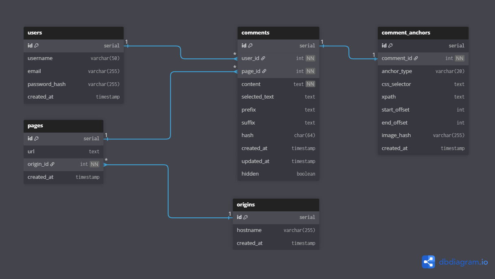

# Introducción

Esta es la primera versión de BD (Base de datos) para **Fortum The Forums**, se conforma de los aspectos más básicos, ya que aspiramos a un MPV (Mínimo Producto Viable).

## 🗃️ Tablas de la base de datos

La BD se encuentra en el siguiente enlace: https://dbdiagram.io/d/FTF-692446bb228c5bbc1a3b0649



## origins

Registra los dominios de las páginas (hostnames). Cada dominio se guarda una sola vez, con un identificador y fecha de registro.

Por ejemplo, un dominio es elpais.com esto es para optimizar el listado de comentarios al entrar en una web, ya que se listarán todos los comentarios de su dominio.

## pages

Contiene las páginas web comentadas. Cada página apunta a su dominio (origin_id) y tiene la URL completa.

La URL es, por ejemplo, https://elpais.com/noticia1 cada registro está asociado a una.

## comments

Guarda los comentarios hechos por los usuarios sobre fragmentos de texto o imágenes. Cada comentario tiene un identificador, referencia al usuario, página y origen, el contenido del comentario, el texto seleccionado, contexto (prefijo y sufijo), hash del texto, fechas de creación y actualización, y un indicador de oculto.

- El contexto sirve para que, si el contenido de la página cambia ligeramente, con prefix y suffix, se pueda intentar buscar el fragmento de nuevo comparando el anterior y posterior del texto seleccionado.

- El hash, por ejemplo, SHA-256 que se genera del texto seleccionado, sirve para comprobar si ese texto ya fue comentado y no generar duplicados.

- El indicador de oculto forma parte de acciones de administrador. No es visible el comentario, pero sigue existiendo en la base de datos.

## comment_anchors

Define la posición exacta del fragmento comentado. Cada anchor pertenece a un comentario (1:1) e indica si es texto o imagen, el selector CSS, la ruta XPath, offsets de inicio y fin para texto, hash de la imagen y fecha de creación.

- anchor_type indica si se aplica sobre un texto o una imagen.
- css_selector es el selector CSS del elemento que contiene el fragmento.
- xpath alternativa a CSS selector, para reanclar.
- start_offset y end_offset dan las posiciones de inicio y fin dentro del texto seleccionado. Solo se aplcia si el anchor es de tipo texto.
- image_hash es el hash de la imagen si el anchor corresponde a una imagen

  Cuando se comenta un fragmento de texto o una imagen, se crea un registro en comment_anchors. Se guarda el CSS selector o XPath del elemento contenedor, junto con los offsets de inicio y fin (si es texto claro).

Si la página cambia, se puede usar prefix/suffix y los selectores para tratar de reanclar el comentario en la posición correcta.

## Referencias

Para el diseño de la base de datos, he tomado como referencia proyectos que realizan este tipo de selecciones, como es hypothesis analizando el json que genera a la hora de seleccionar un texto, añadir una anotación y mandarlo a su base de datos.

He comentado las claves que hacen referencia a las columnas de mi base de datos, como tabla.columna:

```json
{"created": "2025-11-24T17:49:39.591Z", // comments.created_at
  "group": "__world__",
  "permissions": {
    "read": ["acct:rvf1_k@hypothes.is"],
    "update": ["acct:rvf1_k@hypothes.is"],
    "delete": ["acct:rvf1_k@hypothes.is"]
  },
  "tags": [],
  "text": "test 2", // comments.content
  "updated": "2025-11-24T17:49:39.591Z", // comments.updated_at
  "user": "acct:rvf1_k@hypothes.is", // comments.user_id
  "user_info": { "display_name": "rvf1_k" }, // Representa users.username
  "hidden": false, // comments.hidden
  "links": {},
  "document": {
    "title": "Collaborate & Annotate with Hypothesis | Online Annotation Tool",
    "link": [
      { "href": "https://web.hypothes.is/" },
      { "href": "https://web.hypothes.is/", "rel": "canonical", "type": "" } // pages.url
          {
        "href": "https://web.hypothes.is/wp-json/wp/v2/pages/238",
        "rel": "alternate",
        "type": "application/json"
      },
      { "href": "https://web.hypothes.is/", "rel": "shortlink", "type": "" },
      {
        "href": "https://web.hypothes.is/wp-json/oembed/1.0/embed?url=https%3A%2F%2Fweb.hypothes.is%2F",
        "rel": "alternate",
        "type": "application/json+oembed"
      },
      {
        "href": "https://web.hypothes.is/wp-json/oembed/1.0/embed?url=https%3A%2F%2Fweb.hypothes.is%2F&format=xml",
        "rel": "alternate",
        "type": "text/xml+oembed"
      },
      {
        "href": "https://web.hypothes.is/wp-json/tribe/events/v1/",
        "rel": "alternate",
        "type": ""
      }
    ],
    /**
     * Esto son datos de Facebook, Twitter, Favicon, pero no los uso
     *
     * "dc": {},
     *     "eprints": {},
     *     "facebook": {
     *       "locale": ["en_US"],
     *       "type": ["website"],
     *       "title": [
     *         "Collaborate & Annotate with Hypothesis | Online Annotation Tool"
     *       ],
     *       "description": [
     *         "Engage students with Hypothesis, the leading online annotation tool. Create a free account or explore education solutions today!"
     *       ],
     *       "url": ["https://web.hypothes.is/"],
     *       "site_name": ["Hypothesis"],
     *       "image": [
     *         "https://d242fdlp0qlcia.cloudfront.net/uploads/2020/05/25133654/HypothesisFeaturedDefault.png"
     *       ],
     *       "image:width": ["924"],
     *       "image:height": ["554"],
     *       "image:type": ["image/png"]
     *     },
     *     "highwire": {},
     *     "prism": {},
     *     "twitter": { "card": ["summary_large_image"], "site": ["@hypothes_is"] },
     *     "favicon": "https://web.hypothes.is/favicon.ico"
     *   },
     **/
  "uri": "https://web.hypothes.is/",
  "target": [
    {
      "source": "https://web.hypothes.is/",
     "selector": [
        {
          "type": "RangeSelector",          // comment_anchors.anchor_type = "text"
          "startContainer": "/main[1]/div[1]/div[1]/div[1]/div[1]/p[1]", // comment_anchors.css_selector (inicio)
          "startOffset": 76,                // comment_anchors.start_offset
          "endContainer": "/main[1]/div[1]/div[1]/div[1]/div[1]/p[1]/hypothesis-highlight[2]", // comment_anchors.css_selector (fin)
          "endOffset": 0                     // comment_anchors.end_offset
        },{
          "type": "TextPositionSelector",   // comment_anchors.anchor_type = "text"
          "start": 3207,                     // comment_anchors.start_offset (posición absoluta)
          "end": 3217                        // comment_anchors.end_offset
        },{
          "type": "TextQuoteSelector",       // comment_anchors.anchor_type = "text"
          "exact": "everywhere",             // comments.selected_text
          "prefix": "re dead zones. AI shortcuts are ", // comments.prefix
          "suffix": ". Hypothesis transforms passive "  // comments.suffix
        }
      ]
    }
  ]
}
```
